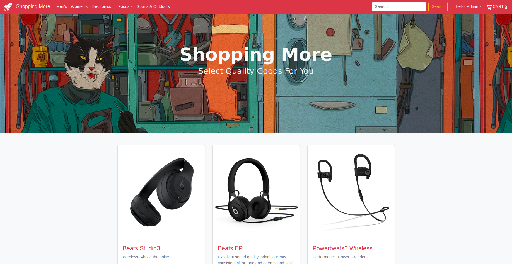
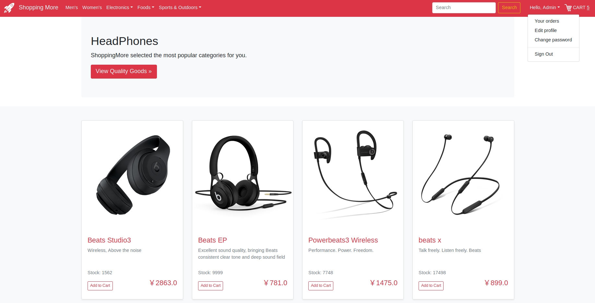
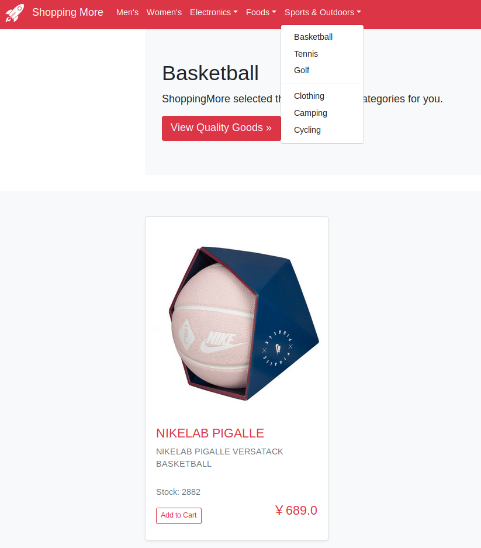
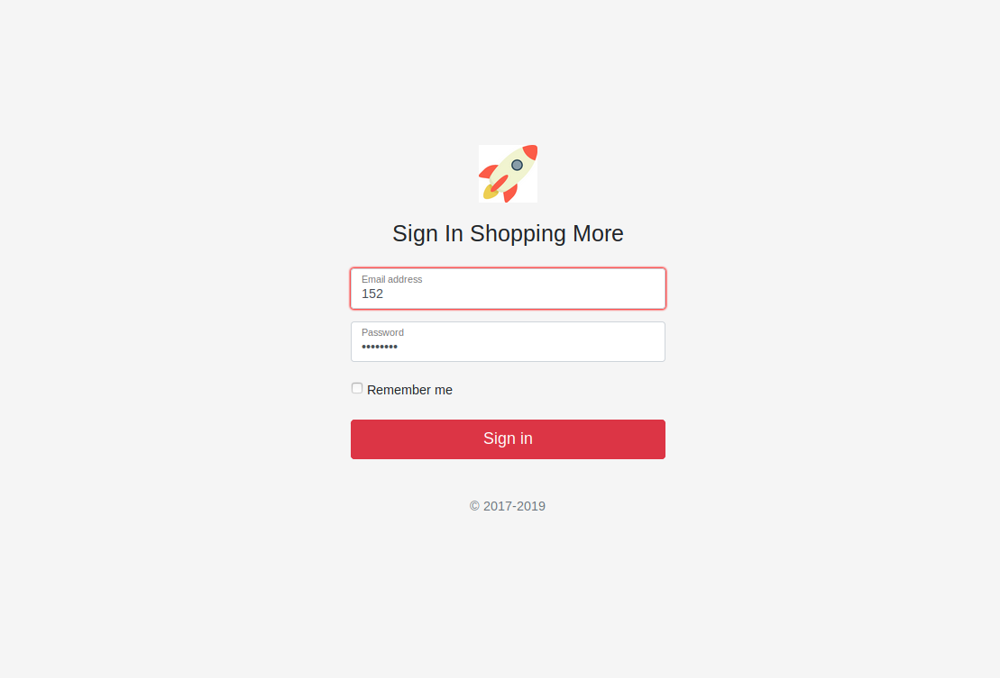
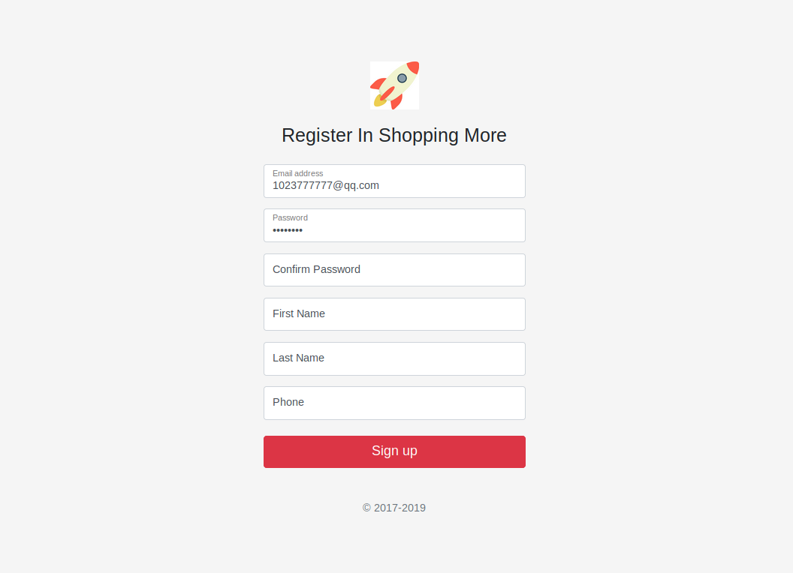
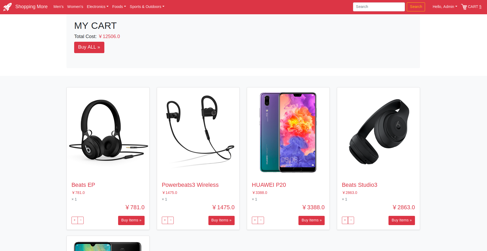
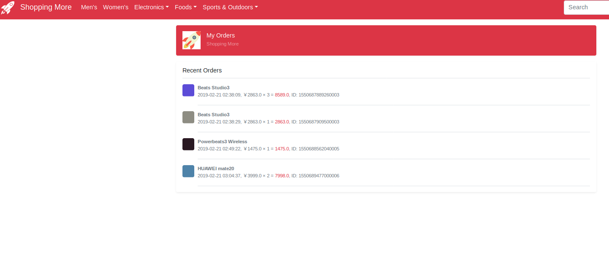

# 准备
1. 在部署本应用前请提前准备好 MySQL 数据库。
MySQL 数据库既可以选择阿里云 MySQL 数据库也可以选择其它 MySQL 数据库。以使用阿里云 MySQL 数据库为例，若使用vpc方式连接阿里云 MySQL 数据库，请参考文档[配置网络](https://help.aliyun.com/document_detail/84514.html)配置VPC网络。
2. 环境变量设置

| 参数名称 | 参数类型 | 是否必填 | 例子 |   参数含义 | 
| --- |  --- |  --- | --- | --- |
| MYSQL_ENDPOINT | String | 必填 | rm-uf6rrswxxxxxxxxxxxx.mysql.rds.aliyuncs.com |   数据库网址，用于连接数据库 |
| MYSQL_PORT | String | 必填 | 3306 |   数据库端口 | 
| MYSQL_DBNAME | String | 必填 | test |   数据库名称 | 
| MYSQL_USER | String | 必填 | fc |   数据库用户名 |  
| MYSQL_PASSWORD | String | 必填 | xxxxxxxx |   数据库密码 |  
3. 初始化数据库
服务开启后访问 domain/init 初始化数据库。

# Shopping More
> A simple and comfortable shopping-mall app on Flask-bootstrap framework.
### 1. How to setup
- Environment: Linux, Python3.6

Download source code: 
```shell
$ git clone https://github.com/icepoint666/shopping-more.git
```
Install dependent packages:
```shell
$ cd shopping-more
$ sudo pip3 install -r requirement.txt
```
(If it can't import sqlite3, please follow [here](https://icepoint666.github.io/2019/02/12/sqlite3-install/) to install it.)

Run it:
```shell
$ python3 app.py
```
("index.py" is used to initialize the database.

"database.db" is stored with some of uploaded information.)

Access the index-page locally (but online):
```
http://localhost:XXXX (default 5000)
```

### 2. User Interface Display

- Home



- Find item by category





- Login



- Register



- My Cart



- My Orders



if administrator needs to add item or remove item from shopping-more.

Go to following URLs:
```buildoutcfg
http://localhost:5000/add
http://localhost:5000/remove  (Click photos of items to remove this item)
```

### 3.To-do-list
- [ ] Create administrator account
- [ ] Search items
- [ ] View description-page of each item
- [ ] Dynamic stock number
- [x] Remove items
